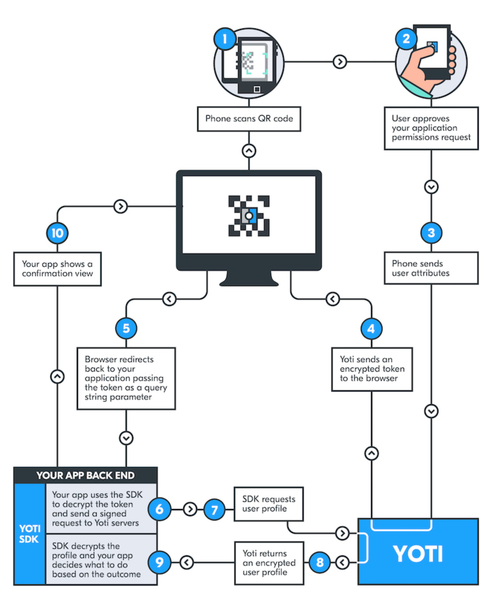

# agents-yoti

A repo to explore integrating the [AEA framework](https://docs.fetch.ai/aea) with [Yoti](https://www.yoti.com).

## Full Demo - Diagrams:

The Yoti-Fetch.ai solution provides Fetch.ai’s autonomous economic agents (that act on behalf of a person) the ability to prove their owner’s identity to another agent (or to a range of stakeholders) in a fully automated scenario such as a DeFi trading environment. 

Here we demonstrate combining Fetch.ai’s autonomous economic agents framework with the reusable Yoti Digital ID to in the future facilitate KYC/AML compliant DeFi trading whilst enabling the core principles of DeFi (no centralised exchange) to be maintained.  

Autonomous economic agents can encapsulate and automate complex interactions with on-chain DeFi smart contracts, as for instance in an algorithmic trading bot. Economic agents can act as well on behalf of human traders. In both cases Fetch.ai agents will be able to securely prove or anchor their verified identity to a public key / wallet address or a series of transactional events without a centralised third party controlling such.

The diagram below describes the interactions between agents and users:


The diagram below describes the user's login process with Yoti and the flow between the Yoti-Fetch.ai agent using the [Yoti Python SDK](https://github.com/getyoti/yoti-python-sdk) and the Yoti servers:


## Running the Demo (Fetch.ai-Yoti Agent only):

### Setting up with Yoti

Please visit the [Getting Started Page](https://developers.yoti.com/yoti-app/getting-started) and [Yoti Hub](https://hub.yoti.com/login) to setup with Yoti.

You will need to create Yoti credentials and register a scenario with Yoti.

### Running the Fetch.ai-Yoti Agent

Create a clean virtual env with all dependencies installed:
``` bash
make new_env
pipenv shell
```

Run ngrok on port 8000:
``` bash
./ngrok http 8000
```

Make sure the ngrok url matches the one registered on Yoti Hub. Add the Yoti SDK `keys` folder in the folder called `yoti_keys`.

Add an environment file `.env` with the following content:
```
export YOTI_CLIENT_SDK_ID=ADD_YOUR_CLIENT_SDK_ID_HERE
export YOTI_KEY_FILE_PATH=ADD_YOUR_KEY_FILE_PATH_HERE
export YOTI_SCENARIO_ID=ADD_YOUR_SCENARIO_ID_HERE
export YOTI_SCENARIO_NAME=identity
```

Fetch the AEA and enter it:
``` bash
aea fetch fetchai/yoti_org
cd yoti_org
aea install
```

Add the `.env` file:
``` bash
cp ../.env .env
```

Run the Fetch.ai-Yoti agent:
``` bash
aea run
```

Visit this `https://{NGROK_URL_HERE}/?address=test` in your browser, then connect your Yoti, then wait for `token found`, then visit same URL again to see data received.

### Future Work

Currently missing for full demo (roughly one full day work) are:

- protocol for communication between Fetch.ai-Yoti agent and Trader and Decentralized Exchange agents

- skills for handling messages between Fetch.ai-Yoti agent and Trader and Decentralized Exchange agents

Trader and Decentralized Exchange can be taken from this demo for instance: https://docs.fetch.ai/aea/generic-skills/


## Development

Install a new development environment and dependencies with
``` bash
make new_env
```

Enter shell
``` bash
pipenv shell
```

Some linters are available
``` bash
make lint
make static
make security
```

To fingerpring packages after modifying them use
``` bash
aea fingerprint by-path PATH
```

