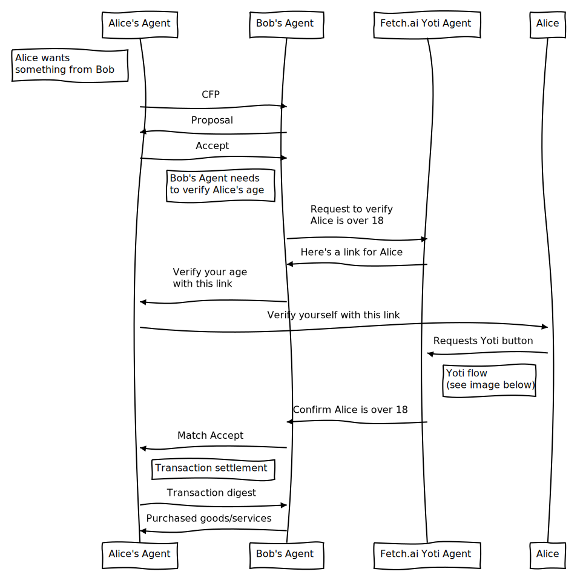

# agents-yoti

A repo to explore integrating the AEA framework with Yoti (https://www.yoti.com)


## Running the Demo (Fetch.ai Yoti Agent only):

Create a clean virtual env
``` bash
make new_env
pipenv shell
make install_env
```

Add the Yoti SDK `keys` folder in the folder called `yoti_keys`.

Add an environment file `.env` with the following content:
```
export YOTI_CLIENT_SDK_ID=ADD_HERE
export YOTI_KEY_FILE_PATH=ADD_HERE
export YOTI_SCENARIO_ID=ADD_HERE
```

Fetch the AEA and enter it:
``` bash
aea -s fetch fetchai/yoti_org
cd yoti_org
aea -s install
aea -s build
```

Add the `.env` file:
``` bash
cp ../.env .env
```

Temporarily, to account for a bug in `.env` file resolution, do:
``` bash
cp ../packages/fetchai/agents/yoti_org/aea-config.yaml aea-config.yaml
```

Run the Fetch.ai Yoti Agent:
``` bash
aea -s run
```

Visit this `https://{NGROK_URL_HERE}/?address=test` in your browser, then connect your Yoti, then wait for `token found`, then visit same URL again to see data received.

Missing for full demo (~1 full day work):
- skills for communication between yoti agent and alice and bob agents
- protocol for communication between yoti agent and alice and bob agents

Alice and Bob agents can be taken from this demo for instance: https://docs.fetch.ai/aea/weather-skills/

## Full Demo UML:


(Created using [this tool](https://bramp.github.io/js-sequence-diagrams/).)

<!-- Note left of Alice's Agent: Alice wants\nsomething from Bob
Alice's Agent->Bob's Agent: CFP
Bob's Agent->Alice's Agent: Proposal
Alice's Agent->Bob's Agent: Accept
Note left of Bob's Agent: Bob's Agent needs\nto verify Alice's age
Bob's Agent->Fetch.ai Yoti Agent: Request to verify\nAlice is over 18
Fetch.ai Yoti Agent->Bob's Agent: Here's a link for Alice
Bob's Agent->Alice's Agent: Verify your age\nwith this link
Alice's Agent->Alice: Verify yourself with this link
Alice->Fetch.ai Yoti Agent: Requests Yoti button
Note left of Alice: Yoti flow\n(see image below)
Fetch.ai Yoti Agent->Bob's Agent: Confirm Alice is over 18
Bob's Agent->Alice's Agent: Match Accept
Note right of Alice's Agent: Transaction settlement
Alice's Agent->Bob's Agent: Transaction digest
Bob's Agent->Alice's Agent: Purchased goods/services
 -->

The Yoti flow follows (taken from Yoti Python SDK repo):


## Development

Install a new development environment with
``` bash
make new_env
```

Enter shell
``` bash
pipenv shell
```

Install development dependencies
``` bash
make install_env
```

Some linters are available
``` bash
make lint
make static
make security
```

## Useful links re Yoti:

- [Yoti Hub to manage App](https://hub.yoti.com/login)
- [Yoti Python SDK](https://github.com/getyoti/yoti-python-sdk)
