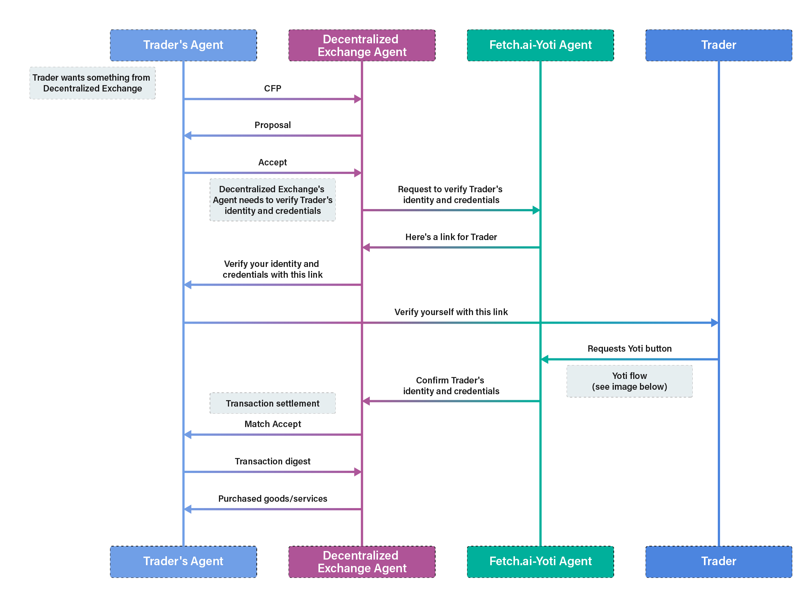

# agents-yoti

A repo to explore integrating the AEA framework with Yoti (https://www.yoti.com)


## Running the Demo (Fetch.ai-Yoti Agent only):

Create a clean virtual env with all dependencies installed
``` bash
make new_env
pipenv shell
```

Add the Yoti SDK `keys` folder in the folder called `yoti_keys`.

Add an environment file `.env` with the following content:
```
export YOTI_CLIENT_SDK_ID=ADD_HERE
export YOTI_KEY_FILE_PATH=ADD_HERE
export YOTI_SCENARIO_ID=ADD_HERE
```

Fetch the AEA and enter it:
``` bash
aea fetch fetchai/yoti_org
cd yoti_org
aea install
```

Add the `.env` file:
``` bash
cp ../.env .env
```

Run the Fetch.ai-Yoti agent:
``` bash
aea run
```

Visit this `https://{NGROK_URL_HERE}/?address=test` in your browser, then connect your Yoti, then wait for `token found`, then visit same URL again to see data received.

Missing for full demo (~1 full day work):
- skills for communication between Fetch.ai-Yoti agent and Trader and Decentralized Exchange agents
- protocol for communication between Fetch.ai-Yoti agent and Trader and Decentralized Exchange agents

Trader and Decentralized Exchange can be taken from this demo for instance: https://docs.fetch.ai/aea/generic-skills/

## Full Demo UML:



The Yoti flow follows (taken from Yoti Python SDK repo):


## Development

Install a new development environment and dependencies with
``` bash
make new_env
```

Enter shell
``` bash
pipenv shell
```

Some linters are available
``` bash
make lint
make static
make security
```

## Useful links re Yoti:

- [Yoti Hub to manage App](https://hub.yoti.com/login)
- [Yoti Python SDK](https://github.com/getyoti/yoti-python-sdk)
